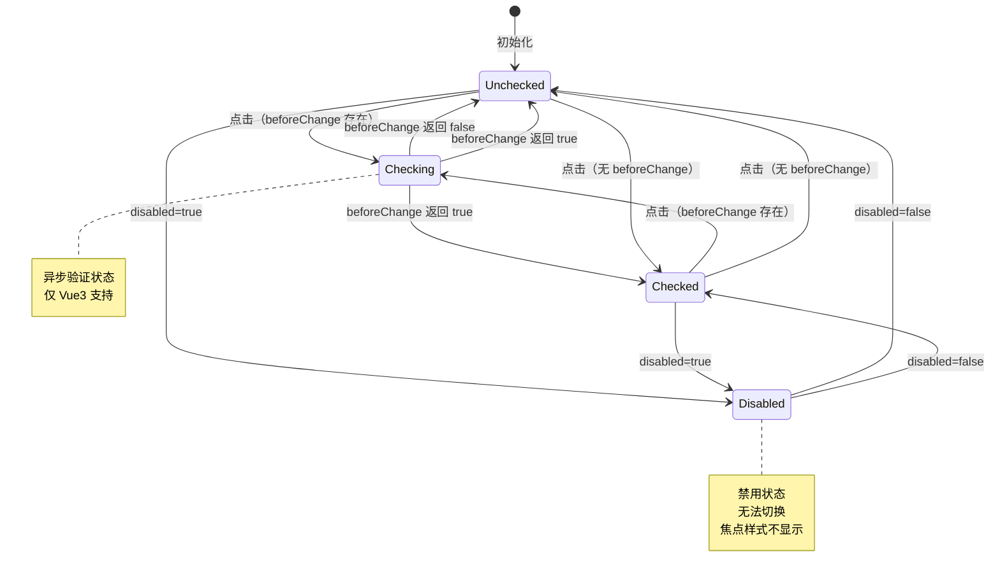

# 数据模型：Switch 组件

**功能编号**: 001  
**创建日期**: 2026-02-11  
**版本**: 1.0

---

## 1. 实体概览

Switch 组件是一个**无状态 UI 组件**，不涉及后端数据持久化。数据模型主要包括：
1. **组件 Props**（输入数据）
2. **组件状态**（内部响应式状态）
3. **事件数据**（输出数据）

---

## 2. 核心实体

### 2.1 `TdSwitchProps` - 组件属性接口

**实体描述**: Switch 组件的所有配置属性

```typescript
export interface TdSwitchProps<T = SwitchValue> {
  /**
   * 异步验证函数（Vue3 特有）
   * @description 状态切换前的回调，返回 false 或 Promise.reject 阻止切换
   * @default undefined
   */
  beforeChange?: () => boolean | Promise<boolean>;

  /**
   * 自定义开关值
   * @description 默认 [true, false]，可自定义为 [1, 0] 或 ['on', 'off']
   * @default undefined
   */
  customValue?: Array<SwitchValue>;

  /**
   * 是否禁用
   * @description 禁用状态下无法点击，且焦点样式不显示
   * @default false
   */
  disabled?: boolean;

  /**
   * 开关标签
   * @description 支持字符串、数组（[选中文本, 未选中文本]）或渲染函数
   * @default undefined
   */
  label?: Array<string | TNode> | TNode;

  /**
   * 是否加载中
   * @description 加载状态显示 Loading 图标，且无法点击
   * @default false
   */
  loading?: boolean;

  /**
   * 开关尺寸
   * @description 影响组件宽高和焦点边框尺寸
   * @default 'medium'
   */
  size?: 'small' | 'medium' | 'large';

  /**
   * 开关值（非受控）
   * @description 与 defaultValue 配合使用
   * @default undefined
   */
  value?: T;

  /**
   * 开关默认值（非受控）
   * @default undefined
   */
  defaultValue?: T;

  /**
   * 开关值（受控）
   * @description v-model 绑定，与 @update:modelValue 配合
   * @default undefined
   */
  modelValue?: T;

  /**
   * 值变更事件
   * @description 切换状态时触发
   */
  onChange?: (value: T, context: { e: MouseEvent }) => void;
}
```

#### 字段约束

| 字段 | 类型 | 必填 | 默认值 | 验证规则 |
|------|------|------|--------|---------|
| `beforeChange` | Function | ❌ | `undefined` | 必须返回 boolean 或 Promise<boolean> |
| `customValue` | Array | ❌ | `undefined` | 长度必须为 2 |
| `disabled` | boolean | ❌ | `false` | - |
| `label` | Array/TNode | ❌ | `undefined` | 数组长度为 2 或单个值 |
| `loading` | boolean | ❌ | `false` | - |
| `size` | string | ❌ | `'medium'` | 必须为 'small'/'medium'/'large' |
| `value` | SwitchValue | ❌ | `undefined` | - |
| `defaultValue` | SwitchValue | ❌ | `undefined` | - |
| `modelValue` | SwitchValue | ❌ | `undefined` | - |
| `onChange` | Function | ❌ | `undefined` | - |

---

### 2.2 `SwitchValue` - 开关值类型

**实体描述**: Switch 组件的值类型联合

```typescript
export type SwitchValue = string | number | boolean;
```

**允许的值**:
- **boolean**: `true` / `false`（默认）
- **number**: `1` / `0`、`100` / `0` 等
- **string**: `'on'` / `'off'`、`'yes'` / `'no'` 等

**示例**:
```typescript
// boolean 值
<t-switch v-model="checked" />  // checked: boolean

// 自定义 number 值
<t-switch v-model="status" :custom-value="[1, 0]" />  // status: 1 | 0

// 自定义 string 值
<t-switch v-model="state" :custom-value="['enabled', 'disabled']" />
```

---

### 2.3 `SwitchInternalState` - 组件内部状态

**实体描述**: Switch 组件的响应式内部状态（仅用于实现，不对外暴露）

```typescript
interface SwitchInternalState {
  /**
   * 当前值（响应式）
   * @description 通过 useVModel 管理，支持受控/非受控模式
   */
  innerValue: ComputedRef<SwitchValue>;

  /**
   * 计算后的选中值
   * @description 基于 customValue[0] 或 true
   */
  activeValue: ComputedRef<SwitchValue>;

  /**
   * 计算后的未选中值
   * @description 基于 customValue[1] 或 false
   */
  inactiveValue: ComputedRef<SwitchValue>;

  /**
   * focusBox DOM 引用
   * @description 用于管理焦点样式的类名
   */
  focusBoxRef: Ref<HTMLElement | undefined>;

  /**
   * 组件样式类名
   * @description 根据 props 计算的完整类名数组
   */
  classes: ComputedRef<Array<string | Record<string, boolean>>>;

  /**
   * 手柄样式类名
   * @description Loading 图标或手柄的类名
   */
  nodeClasses: ComputedRef<Array<string | Record<string, boolean>>>;

  /**
   * 内容区域样式类名
   * @description label 文本的容器类名
   */
  contentClasses: ComputedRef<Array<string | Record<string, boolean>>>;
}
```

---

### 2.4 `SwitchEventContext` - 事件上下文

**实体描述**: onChange 事件的上下文对象

```typescript
export interface SwitchEventContext {
  /**
   * 原始鼠标事件
   * @description 用户点击 Switch 时的 MouseEvent
   */
  e: MouseEvent;
}
```

**使用示例**:
```typescript
<t-switch
  v-model="checked"
  @change={(value, context) => {
    console.log('新值:', value);
    console.log('点击位置:', context.e.clientX, context.e.clientY);
  }}
/>
```

---

## 3. 状态转换

### 3.1 状态机模型



### 3.2 状态转换规则

| 当前状态 | 触发条件 | 目标状态 | 副作用 |
|---------|---------|---------|--------|
| Unchecked | 点击 + 无 beforeChange | Checked | 触发 onChange 事件 |
| Unchecked | 点击 + beforeChange | Checking | 等待 Promise 结果 |
| Checking | beforeChange 返回 true | Checked | 触发 onChange 事件 |
| Checking | beforeChange 返回 false | Unchecked | 无副作用 |
| Checked | 点击 + 无 beforeChange | Unchecked | 触发 onChange 事件 |
| Checked | 点击 + beforeChange | Checking | 等待 Promise 结果 |
| Disabled | 点击 | Disabled | 无响应 |
| Loading | 点击 | Loading | 无响应 |

---

### 3.3 值转换逻辑

```typescript
// 示例：自定义值转换
const props = {
  customValue: [1, 0],  // [activeValue, inactiveValue]
  modelValue: 1
};

// 计算逻辑
const activeValue = computed(() => 
  props.customValue?.[0] ?? true
);  // 结果: 1

const inactiveValue = computed(() => 
  props.customValue?.[1] ?? false
);  // 结果: 0

// 状态判断
const isChecked = computed(() => 
  innerValue.value === activeValue.value
);  // modelValue=1 → isChecked=true
```

---

## 4. 数据流图

### 4.1 受控模式数据流

```
┌─────────────┐
│   Parent    │
│  Component  │
└──────┬──────┘
       │ v-model
       │ (modelValue)
       ↓
┌─────────────────────────┐
│   TSwitch Component     │
│  ┌───────────────────┐  │
│  │  useVModel Hook   │  │
│  │  ┌─────────────┐  │  │
│  │  │ innerValue  │  │  │
│  │  └──────┬──────┘  │  │
│  └─────────┼─────────┘  │
│            ↓            │
│  ┌─────────────────┐   │
│  │ handleToggle()  │   │
│  └─────────┬───────┘   │
│            │            │
│            ↓            │
│  ┌─────────────────┐   │
│  │ setSwitchVal()  │   │ (触发 onChange)
│  └─────────┬───────┘   │
└────────────┼───────────┘
             │
             ↓
      emit('update:modelValue')
             │
             ↓
      ┌─────────────┐
      │   Parent    │
      │ modelValue  │ (更新)
      └─────────────┘
```

---

### 4.2 非受控模式数据流

```
┌─────────────┐
│   Parent    │
│  Component  │
└──────┬──────┘
       │ defaultValue
       │ (仅初始化)
       ↓
┌─────────────────────────┐
│   TSwitch Component     │
│  ┌───────────────────┐  │
│  │  useVModel Hook   │  │
│  │  ┌─────────────┐  │  │
│  │  │ innerValue  │  │  │ (内部管理)
│  │  └──────┬──────┘  │  │
│  └─────────┼─────────┘  │
│            ↓            │
│  ┌─────────────────┐   │
│  │ handleToggle()  │   │
│  └─────────┬───────┘   │
│            │            │
│            ↓            │
│  ┌─────────────────┐   │
│  │ setSwitchVal()  │   │ (触发 onChange)
│  └─────────┬───────┘   │
└────────────┼───────────┘
             │
             ↓
      emit('change', value, { e })
             │
             ↓
      ┌─────────────┐
      │   Parent    │
      │  @change    │ (监听)
      └─────────────┘
```

---

### 4.3 焦点状态数据流

```
User Action (Tab Key)
        │
        ↓
  onFocus Event
        │
        ↓
┌──────────────────┐
│  handleFocus()   │
│  ┌────────────┐  │
│  │ focusBoxRef│  │
│  └──────┬─────┘  │
│         │        │
│         ↓        │
│  classList.add   │
│  ('focusInput')  │
└──────────────────┘
        │
        ↓
┌──────────────────┐
│  CSS Rendering   │
│  .focusBox {     │
│    display:      │
│    inline-block  │
│  }               │
└──────────────────┘
```

---

## 5. 验证规则

### 5.1 Props 验证

```typescript
// customValue 验证
watch(innerValue, (val) => {
  if (props.customValue && props.customValue.length) {
    if (!props.customValue.includes(val)) {
      throw new Error(
        `value is ${val} not in ${JSON.stringify(props.customValue)}`
      );
    }
  }
}, { immediate: true });
```

**验证逻辑**:
1. 如果设置了 `customValue`
2. 且 `innerValue` 不在 `customValue` 数组中
3. 抛出错误（开发模式）

---

### 5.2 状态验证

| 验证项 | 规则 | 错误处理 |
|--------|------|---------|
| 禁用状态下点击 | `disabled=true` → 阻止切换 | 静默忽略 |
| 加载状态下点击 | `loading=true` → 阻止切换 | 静默忽略 |
| beforeChange 拒绝 | Promise.reject → 阻止切换 | 控制台错误 |
| customValue 不合法 | 值不在数组中 → 抛出异常 | throw Error |

---

## 6. 数据关系图

### 6.1 实体关系

```
┌────────────────────┐
│   TdSwitchProps    │
│  ┌──────────────┐  │
│  │ customValue  │──┐
│  └──────────────┘  │
│  ┌──────────────┐  │
│  │ modelValue   │──┼─► SwitchValue (string | number | boolean)
│  └──────────────┘  │
│  ┌──────────────┐  │
│  │defaultValue  │──┘
│  └──────────────┘  │
│  ┌──────────────┐  │
│  │ beforeChange │──┐
│  └──────────────┘  │
│  ┌──────────────┐  │
│  │   onChange   │──┼─► SwitchEventContext { e: MouseEvent }
│  └──────────────┘  │
└────────────────────┘
                     │
                     ↓
         ┌───────────────────┐
         │ SwitchInternalState│
         │  ┌─────────────┐  │
         │  │ innerValue  │  │
         │  └─────────────┘  │
         │  ┌─────────────┐  │
         │  │activeValue  │  │
         │  └─────────────┘  │
         │  ┌─────────────┐  │
         │  │inactiveValue│  │
         │  └─────────────┘  │
         └───────────────────┘
```

---

## 7. 示例数据

### 7.1 默认配置（boolean 值）

```typescript
{
  // Props
  modelValue: false,
  size: 'medium',
  disabled: false,
  loading: false,
  
  // 内部计算
  activeValue: true,
  inactiveValue: false,
  
  // 状态
  isChecked: false,
  
  // 样式类名
  classes: [
    't-switch',
    't-size-m'
  ]
}
```

---

### 7.2 自定义配置（number 值 + label）

```typescript
{
  // Props
  modelValue: 1,
  customValue: [1, 0],
  size: 'large',
  label: ['开', '关'],
  
  // 内部计算
  activeValue: 1,
  inactiveValue: 0,
  
  // 状态
  isChecked: true,  // modelValue=1 === activeValue
  
  // 样式类名
  classes: [
    't-switch',
    't-size-l',
    't-is-checked'
  ],
  
  // 渲染内容
  content: '开'  // label[0]
}
```

---

### 7.3 禁用状态 + 焦点

```typescript
{
  // Props
  modelValue: false,
  disabled: true,
  
  // 内部状态
  focusBoxRef: {
    classList: {
      contains: (className) => false  // 禁用状态下不添加 focusInput
    }
  },
  
  // 样式类名
  classes: [
    't-switch',
    't-size-m',
    't-is-disabled'  // 禁用状态
  ],
  
  // CSS 规则生效
  // .t-is-disabled .focusBox { display: none !important; }
}
```

---

### 7.4 异步验证场景（Vue3 特有）

```typescript
{
  // Props
  modelValue: false,
  beforeChange: async () => {
    const result = await api.checkPermission();
    return result.allowed;
  },
  
  // 点击流程
  // 1. 用户点击 → toggle()
  // 2. 检测到 beforeChange → Promise.resolve(props.beforeChange())
  // 3. 等待 Promise 结果
  // 4a. 如果 result=true → handleToggle() → 切换状态
  // 4b. 如果 result=false → 无操作
}
```

---

## 8. 数据完整性约束

### 8.1 必须满足的约束

1. **值域约束**:
   - `size` 必须为 `'small' | 'medium' | 'large'` 之一
   - `customValue` 如果存在，长度必须为 2

2. **逻辑约束**:
   - `value` 和 `modelValue` 不能同时设置（由 useVModel 处理）
   - `disabled=true` 时，点击无响应
   - `loading=true` 时，点击无响应

3. **类型约束**:
   - `beforeChange` 返回值必须为 `boolean | Promise<boolean>`
   - `onChange` 回调参数类型必须匹配 `(value: SwitchValue, context: { e: MouseEvent }) => void`

---

### 8.2 边界情况处理

| 边界情况 | 处理方式 |
|---------|---------|
| `customValue` 为空数组 | 使用默认值 `[true, false]` |
| `customValue` 长度为 1 | 仅使用第一个值作为 activeValue，inactiveValue 为 false |
| `beforeChange` 返回 undefined | 视为 false，阻止切换 |
| `beforeChange` 抛出异常 | 捕获并输出错误，阻止切换 |
| 点击时 `focusBoxRef.value` 为 undefined | 使用可选链 `?.`，静默忽略 |

---

## 9. 总结

### 9.1 数据模型特点

1. **简单清晰**: 仅 3 个核心实体（Props、内部状态、事件上下文）
2. **类型安全**: 完整的 TypeScript 类型定义
3. **响应式**: 使用 Vue3 Composition API 管理状态
4. **可扩展**: 支持自定义值、异步验证等高级特性

### 9.2 与 Vue2 版本的差异

| 数据项 | Vue2 | Vue3 | 说明 |
|--------|------|------|------|
| `modelValue` | ❌ | ✅ | Vue3 标准 v-model |
| `beforeChange` | ❌ | ✅ | 异步验证特性 |
| `innerValue` | `data()` 返回 | `ref()` / `computed()` | 响应式实现方式 |
| `focusBoxRef` | `this.$el.children[2]` | `ref<HTMLElement>()` | DOM 引用方式 |

---

**数据模型状态**: ✅ 完成  
**下一步**: 创建 API 契约（contracts/）
