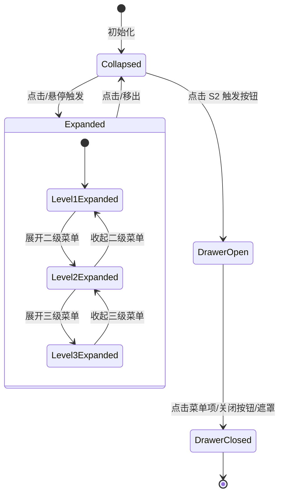

# 数据模型：Menu Vue3 迁移

**功能编号**: 006  
**创建日期**: 2026-02-25  
**状态**: 设计完成

---

## 1. 数据模型概述

本文档定义 Menu 组件的核心数据结构、状态管理和数据流转。

---

## 2. 核心实体定义

### 2.1 MenuValue (菜单值类型)

**用途**: 菜单项的唯一标识符

```typescript
/**
 * 菜单项值类型
 * - string: 字符串标识符 (推荐)
 * - number: 数字标识符
 */
export type MenuValue = string | number;
```

**示例**:
```typescript
const menuItems: MenuValue[] = ['home', 'about', 'contact'];
const menuItems2: MenuValue[] = [1, 2, 3];
```

**验证规则**:
- 必须唯一（同一菜单层级内）
- 不能为 null 或 undefined
- 推荐使用字符串（可读性更好）

---

### 2.2 MenuItem (菜单项数据)

**用途**: 单个菜单项的完整数据结构

```typescript
/**
 * 菜单项数据结构
 */
export interface MenuItem {
  /** 唯一标识符 (必填) */
  value: MenuValue;
  
  /** 显示文本 (必填) */
  title: string;
  
  /** 图标 (可选) */
  icon?: TNode;
  
  /** 路由地址 (可选) */
  to?: string | { path: string; query?: Record<string, any> };
  
  /** 是否禁用 (可选, 默认 false) */
  disabled?: boolean;
  
  /** 子菜单项 (可选) */
  children?: MenuItem[];
  
  /** 自定义数据 (可选) */
  meta?: Record<string, any>;
}
```

**示例**:
```typescript
const homeMenu: MenuItem = {
  value: 'home',
  title: 'Home',
  icon: () => h(HomeIcon),
  children: [
    {
      value: 'dashboard',
      title: 'Dashboard',
      to: '/dashboard',
    },
    {
      value: 'profile',
      title: 'Profile',
      to: '/profile',
      disabled: false,
    },
  ],
};
```

**验证规则**:
- `value` 必须唯一
- `title` 不能为空字符串
- `children` 最多 3 层嵌套（与 Vue2 一致）
- `to` 存在时,点击菜单项触发路由跳转

---

### 2.3 TdMenuProps (Menu 组件 Props)

**用途**: Menu 组件的完整属性定义

```typescript
/**
 * Menu 组件 Props
 */
export interface TdMenuProps {
  /** S2 规范开关 (默认 true) */
  s2?: boolean;
  
  /** 鼠标悬停触发 (默认 false) */
  mouseOverTrigger?: boolean;
  
  /** 收起菜单 (默认 false) */
  collapsed?: boolean;
  
  /** 展开的菜单项 (受控) */
  expanded?: Array<MenuValue>;
  
  /** 默认展开的菜单项 (非受控) */
  defaultExpanded?: Array<MenuValue>;
  
  /** 同级互斥展开 (默认 false) */
  expandMutex?: boolean;
  
  /** 二级菜单展开方式 (默认 'normal') */
  expandType?: 'normal' | 'popup';
  
  /** 三级菜单展开方式 (默认 'popup') */
  thirdExpandType?: 'normal' | 'popup';
  
  /** 站点 LOGO */
  logo?: TNode;
  
  /** 操作区域 */
  operations?: TNode;
  
  /** 主题 (默认 'light') */
  theme?: 'light' | 'dark';
  
  /** 激活菜单项 (受控) */
  value?: MenuValue;
  
  /** 默认激活菜单项 (非受控) */
  defaultValue?: MenuValue;
  
  /** 菜单宽度 */
  width?: string | number | [string | number, string | number];
  
  /** 变更回调 */
  onChange?: (value: MenuValue) => void;
  
  /** 展开回调 */
  onExpand?: (value: Array<MenuValue>) => void;
}
```

**默认值**:
```typescript
const defaultProps: Partial<TdMenuProps> = {
  s2: true,
  mouseOverTrigger: false,
  collapsed: false,
  expandMutex: false,
  expandType: 'normal',
  thirdExpandType: 'popup',
  theme: 'light',
  width: ['300px', '64px'], // [展开宽度, 收起宽度]
};
```

**验证规则**:
- `expanded` 和 `defaultExpanded` 互斥（受控 vs 非受控）
- `value` 和 `defaultValue` 互斥
- `width` 数组格式时,第一个元素为展开宽度,第二个为收起宽度
- `thirdExpandType` 仅在 `expandType='normal'` 时生效

---

### 2.4 S2MenuState (S2 规范状态)

**用途**: S2 规范（Drawer 抽屉菜单）的内部状态

```typescript
/**
 * S2 Menu 内部状态
 */
export interface S2MenuState {
  /** Drawer 可见性 */
  visible: boolean;
  
  /** 触发按钮图标 (默认 ViewListIcon) */
  triggerIcon: TNode;
  
  /** 关闭按钮图标 (默认 CloseCircleIcon) */
  closeIcon: TNode;
}
```

**初始状态**:
```typescript
const initialS2State: S2MenuState = {
  visible: false,
  triggerIcon: () => h(ViewListIcon),
  closeIcon: () => h(CloseCircleIcon),
};
```

**状态转换**:
```typescript
// 打开 Drawer
s2MenuVisible.value = true;

// 关闭 Drawer (3 种方式)
// 1. 点击关闭按钮
s2MenuVisible.value = false;
// 2. 点击菜单项
handleMenuItemClick() {
  if (props.s2) {
    s2MenuVisible.value = false;
  }
}
// 3. 点击外部遮罩 (Drawer 的 closeOnOverlayClick=true)
```

---

### 2.5 TdMenuInterface (Provide/Inject 接口)

**用途**: 通过 provide/inject 在组件树中共享的数据

```typescript
/**
 * Menu 组件 Provide 接口
 */
export interface TdMenuInterface {
  /** 菜单模式 (normal/popup) */
  mode: Ref<'normal' | 'popup'>;
  
  /** 三级菜单模式 */
  thirdMode: Ref<'normal' | 'popup'>;
  
  /** 当前激活值 */
  activeValue: Ref<MenuValue | undefined>;
  
  /** 当前展开值列表 */
  expandedValues: Ref<Array<MenuValue>>;
  
  /** 是否收起 */
  collapsed: Ref<boolean>;
  
  /** 主题 */
  theme: Ref<'light' | 'dark'>;
  
  /** 鼠标悬停触发 */
  mouseOverTrigger: Ref<boolean>;
  
  /** 同级互斥展开 */
  expandMutex: Ref<boolean>;
  
  /** 激活菜单项 */
  select: (value: MenuValue) => void;
  
  /** 切换展开状态 */
  toggleExpanded: (value: MenuValue) => void;
}
```

**使用示例**:
```typescript
// menu.tsx (provide)
provide<TdMenuInterface>('TdMenu', {
  mode,
  thirdMode,
  activeValue,
  expandedValues,
  collapsed,
  theme,
  mouseOverTrigger,
  expandMutex,
  select,
  toggleExpanded,
});

// submenu.tsx (inject)
const menuContext = inject<TdMenuInterface>('TdMenu');
const { mode, thirdMode, activeValue } = menuContext;
```

---

## 3. 状态管理

### 3.1 组件内部状态

**Menu 组件 (menu.tsx)**:
```typescript
export default defineComponent({
  setup(props) {
    // 受控 vs 非受控状态
    const activeValue = ref(props.value ?? props.defaultValue);
    const expandedValues = ref(props.expanded ?? props.defaultExpanded ?? []);
    
    // 监听受控 Props 变化
    watch(() => props.value, (newValue) => {
      if (newValue !== undefined) {
        activeValue.value = newValue;
      }
    });
    
    watch(() => props.expanded, (newExpanded) => {
      if (newExpanded !== undefined) {
        expandedValues.value = newExpanded;
      }
    });
    
    return {
      activeValue,
      expandedValues,
    };
  },
});
```

**HeadMenu 组件 (head-menu.tsx)**:
```typescript
export default defineComponent({
  setup(props) {
    // S2 Drawer 状态
    const s2MenuVisible = ref(false);
    
    const openDrawer = () => {
      s2MenuVisible.value = true;
    };
    
    const closeDrawer = () => {
      s2MenuVisible.value = false;
    };
    
    return {
      s2MenuVisible,
      openDrawer,
      closeDrawer,
    };
  },
});
```

---

### 3.2 状态流转图



---

### 3.3 受控 vs 非受控模式

| 属性 | 受控模式 | 非受控模式 |
|------|---------|-----------|
| **激活值** | `value` (受控) | `defaultValue` (非受控) |
| **展开值** | `expanded` (受控) | `defaultExpanded` (非受控) |
| **触发事件** | `onChange` / `onExpand` | 仅内部状态变化 |
| **父组件控制** | ✅ 完全控制 | ❌ 仅初始值 |

**受控模式示例**:
```vue
<template>
  <t-menu
    :value="activeMenu"
    :expanded="expandedMenus"
    @change="handleChange"
    @expand="handleExpand"
  >
    <!-- 菜单项 -->
  </t-menu>
</template>

<script setup>
const activeMenu = ref('home');
const expandedMenus = ref(['dashboard']);

const handleChange = (value) => {
  activeMenu.value = value;
};

const handleExpand = (values) => {
  expandedMenus.value = values;
};
</script>
```

**非受控模式示例**:
```vue
<template>
  <t-menu
    default-value="home"
    :default-expanded="['dashboard']"
  >
    <!-- 菜单项 -->
  </t-menu>
</template>
```

---

## 4. 数据验证

### 4.1 Props 验证

```typescript
// props.ts
export default {
  s2: {
    type: Boolean,
    default: true,
  },
  mouseOverTrigger: {
    type: Boolean,
    default: false,
  },
  collapsed: {
    type: Boolean,
    default: false,
  },
  expanded: {
    type: Array as PropType<Array<MenuValue>>,
    validator: (value: Array<MenuValue>) => {
      return value.every(v => typeof v === 'string' || typeof v === 'number');
    },
  },
  expandType: {
    type: String as PropType<'normal' | 'popup'>,
    default: 'normal',
    validator: (value: string) => ['normal', 'popup'].includes(value),
  },
  thirdExpandType: {
    type: String as PropType<'normal' | 'popup'>,
    default: 'popup',
    validator: (value: string) => ['normal', 'popup'].includes(value),
  },
  theme: {
    type: String as PropType<'light' | 'dark'>,
    default: 'light',
    validator: (value: string) => ['light', 'dark'].includes(value),
  },
  width: {
    type: [String, Number, Array] as PropType<string | number | [string | number, string | number]>,
    default: () => ['300px', '64px'],
  },
};
```

---

### 4.2 运行时验证

```typescript
// 验证 MenuValue 唯一性
const validateMenuValues = (items: MenuItem[], path: MenuValue[] = []): boolean => {
  const values = new Set<MenuValue>();
  
  for (const item of items) {
    if (values.has(item.value)) {
      console.error(`Duplicate menu value: ${item.value} at path: ${path.join(' > ')}`);
      return false;
    }
    values.add(item.value);
    
    if (item.children) {
      if (!validateMenuValues(item.children, [...path, item.value])) {
        return false;
      }
    }
  }
  
  return true;
};

// 验证菜单层级深度
const validateMenuDepth = (items: MenuItem[], depth: number = 0): boolean => {
  if (depth > 3) {
    console.warn(`Menu depth exceeds 3 levels`);
    return false;
  }
  
  for (const item of items) {
    if (item.children) {
      if (!validateMenuDepth(item.children, depth + 1)) {
        return false;
      }
    }
  }
  
  return true;
};
```

---

## 5. 数据流转示例

### 5.1 点击菜单项激活

```typescript
// 1. 用户点击菜单项
<t-menu-item value="home" @click="handleMenuItemClick">

// 2. MenuItem 组件触发 select
const handleMenuItemClick = () => {
  const { select } = inject<TdMenuInterface>('TdMenu');
  select(props.value);
};

// 3. Menu 组件更新 activeValue
const select = (value: MenuValue) => {
  if (props.value === undefined) {
    // 非受控模式
    activeValue.value = value;
  }
  
  // 触发 onChange 事件
  props.onChange?.(value);
  
  // S2 规范: 点击菜单项关闭 Drawer
  if (props.s2 && s2MenuVisible.value) {
    s2MenuVisible.value = false;
  }
};

// 4. 父组件接收事件 (受控模式)
const handleChange = (value: MenuValue) => {
  activeMenu.value = value;
  router.push(`/${value}`);
};
```

---

### 5.2 展开子菜单

```typescript
// 1. 用户点击子菜单标题
<t-submenu value="dashboard" title="Dashboard">

// 2. Submenu 组件切换展开状态
const handleToggle = () => {
  const { toggleExpanded } = inject<TdMenuInterface>('TdMenu');
  toggleExpanded(props.value);
};

// 3. Menu 组件更新 expandedValues
const toggleExpanded = (value: MenuValue) => {
  const index = expandedValues.value.indexOf(value);
  
  if (index > -1) {
    // 收起
    expandedValues.value = expandedValues.value.filter(v => v !== value);
  } else {
    // 展开
    if (props.expandMutex) {
      // 同级互斥: 关闭其他同级菜单
      expandedValues.value = [value];
    } else {
      expandedValues.value = [...expandedValues.value, value];
    }
  }
  
  // 触发 onExpand 事件
  props.onExpand?.(expandedValues.value);
};

// 4. 父组件接收事件 (受控模式)
const handleExpand = (values: Array<MenuValue>) => {
  expandedMenus.value = values;
  console.log('Expanded menus:', values);
};
```

---

## 6. 性能优化

### 6.1 Computed 缓存

```typescript
// 使用 computed 避免不必要的重新计算
const isActive = computed(() => {
  return activeValue.value === props.value;
});

const isExpanded = computed(() => {
  return expandedValues.value.includes(props.value);
});

const popupProps = computed(() => ({
  trigger: props.mouseOverTrigger ? 'hover' : 'click',
  placement: 'right-top',
  hideEmptyPopup: true,
}));
```

---

### 6.2 事件委托

```typescript
// 使用事件委托避免为每个菜单项绑定事件
const handleMenuClick = (e: Event) => {
  const target = e.target as HTMLElement;
  const menuItem = target.closest('[data-menu-value]');
  
  if (menuItem) {
    const value = menuItem.getAttribute('data-menu-value');
    select(value);
  }
};
```

---

## 7. 类型导出

```typescript
// types.ts
export type {
  MenuValue,
  MenuItem,
  TdMenuProps,
  S2MenuState,
  TdMenuInterface,
};

// 主题枚举
export enum MenuTheme {
  Light = 'light',
  Dark = 'dark',
}

// 展开方式枚举
export enum ExpandType {
  Normal = 'normal',
  Popup = 'popup',
}
```

---

**数据模型状态**: ✅ 设计完成  
**审核人**: -  
**审核日期**: -
