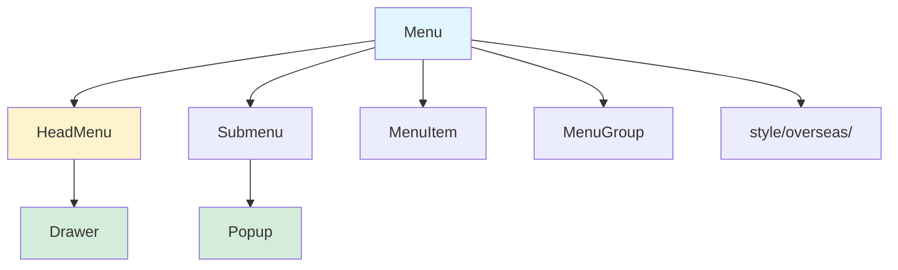
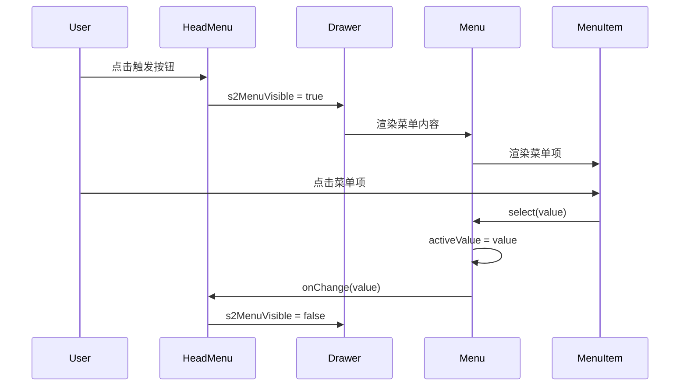

# 实施方案：Menu Vue3 迁移

**功能编号**: 006  
**创建日期**: 2026-02-25  
**状态**: 方案完成，准备实施  
**分支**: `feature/006-menu-vue3-migration`

---

## 📋 方案概览

本实施方案将 TDesign 海外版 UI 组件库的 Menu（导航菜单）组件从 Vue 2.6 迁移到 Vue 3，确保与 Vue2 版本 **100% 功能一致**，包括 S2 规范的特殊功能（Drawer 抽屉菜单、mouseOverTrigger、thirdExpandType）。

---

## 🎯 目标

1. ✅ **功能完整性**: 所有 Vue2 版本功能在 Vue3 中保持一致
2. ✅ **样式一致性**: 视觉外观与 Vue2 版本完全相同
3. ✅ **API 兼容性**: Props、Events、Slots 保持 100% 兼容
4. ✅ **性能优化**: 利用 Vue 3 特性提升性能
5. ✅ **代码质量**: TypeScript 类型安全、ESLint 通过、测试覆盖率 > 80%

---

## 📂 相关文档

| 文档 | 路径 | 状态 |
|------|------|------|
| **功能规格** | [spec.md](../spec.md) | ✅ 完成 |
| **研究文档** | [research.md](./research.md) | ✅ 完成 |
| **数据模型** | [data-model.md](./data-model.md) | ✅ 完成 |
| **API 契约** | [../contracts/api-contract.md](../contracts/api-contract.md) | ✅ 完成 |
| **快速开始** | [quickstart.md](./quickstart.md) | ✅ 完成 |
| **验收清单** | [../checklists/requirements.md](../checklists/requirements.md) | ✅ 完成 |

---

## 🗂 技术上下文

### 技术栈

| 技术 | 版本 | 说明 |
|------|------|------|
| **Vue** | 3.2+ | Composition API |
| **TypeScript** | 4.x | 类型安全 |
| **构建工具** | Vite | 开发服务器 + 构建 |
| **样式** | LESS | 样式预处理器 |
| **测试框架** | Vitest | 单元测试 |
| **组件库** | TDesign Vue 3 | Drawer、Popup 组件 |
| **图标库** | @tencent/s2-icons-vue | 图标组件 |

---

### 依赖关系

```mermaid
graph LR
    A[Menu.tsx] --> B[@tdesign/vue-next]
    A --> C[@tencent/s2-icons-vue]
    A --> D[@tdesign/shared-hooks]
    
    E[HeadMenu.tsx] --> A
    E --> F[Drawer Component]
    
    F --> B
    
    G[Submenu.tsx] --> H[Popup Component]
    H --> B
    
    I[style/overseas/*.less] --> J[LESS Compiler]
```

---

### 集成点

| 组件 | 依赖 | 集成方式 |
|------|------|---------|
| **HeadMenu** | Drawer (@tdesign/vue-next) | 导入并使用 `<t-drawer>` |
| **Submenu** | Popup (@tdesign/vue-next) | 导入并使用 `<t-popup>` |
| **MenuItem** | ViewListIcon, CloseCircleIcon | 从 @tencent/s2-icons-vue 导入 |
| **样式** | LESS 变量 | 从 _var.less 导入 |

---

## 📐 架构设计

### 组件关系图



---

### 数据流图



---

## 🛠 实施阶段

### 阶段 0: 样式文件迁移 (3 小时)

#### 任务清单

- [x] 创建 `style/overseas/` 目录结构
- [x] 复制 Vue2 的 `_var.less`（样式变量）
- [x] 复制 Vue2 的 `_mixin.less`（Mixin 工具）
- [x] 复制 Vue2 的 `_transition.less`（过渡动画）
- [x] 复制 `_index.less` 并重命名为 `_menu.less`
- [x] 创建 `overseas/index.less` 入口文件
- [x] 验证样式编译无错误

#### 验收标准

- ✅ 所有 LESS 文件编译通过
- ✅ S2 规范样式完整迁移（s2-menu、Drawer、trigger）
- ✅ 运行 `npm run build` 无样式错误

#### 输出物

- `style/overseas/_var.less`
- `style/overseas/_mixin.less`
- `style/overseas/_transition.less`
- `style/overseas/_menu.less`
- `style/overseas/index.less`

---

### 阶段 1: 核心组件迁移 (6 小时)

#### 任务清单

**1. 更新 Props 定义 (1 小时)**
- [x] 在 `props.ts` 中添加 `s2`、`mouseOverTrigger`、`thirdExpandType`
- [x] 更新 `TdMenuProps` 类型定义
- [x] 添加 Props 验证规则

**2. 迁移 Menu 组件 (1.5 小时)**
- [x] 添加 `thirdMode` 状态管理
- [x] 在 provide 中传递 `thirdMode` 和 `mouseOverTrigger`
- [x] 保持其他逻辑与 Vue2 一致

**3. 迁移 HeadMenu 组件 (2 小时)**
- [x] 集成 Drawer 组件 (从 @tdesign/vue-next)
- [x] 实现 `s2MenuVisible` 响应式状态
- [x] 添加 `#s2Menu` 和 `#trigger` 插槽
- [x] 实现关闭按钮（CloseCircleIcon）
- [x] 实现触发按钮（ViewListIcon）
- [x] 实现点击菜单项自动关闭抽屉逻辑

**4. 迁移 Submenu 组件 (1 小时)**
- [x] 支持 `thirdExpandType` 属性
- [x] 根据层级判断展开方式（normal/popup）
- [x] 支持 `mouseOverTrigger` 属性
- [x] 动态设置 Popup trigger 为 hover 或 click

**5. 迁移 MenuItem 和 MenuGroup (0.5 小时)**
- [x] MenuItem: 保持与 Vue2 一致
- [x] MenuGroup: 保持与 Vue2 一致
- [x] 确保路由跳转功能正常

#### 验收标准

- ✅ TypeScript 类型检查通过 (`npx vue-tsc --noEmit`)
- ✅ ESLint 检查通过 (`pnpm run lint`)
- ✅ 所有 Props 功能正常
- ✅ S2 Drawer 打开/关闭正常
- ✅ mouseOverTrigger 触发正常
- ✅ thirdExpandType 控制正常

#### 输出物

- `menu.tsx`（已更新）
- `head-menu.tsx`（已更新）
- `submenu.tsx`（已更新）
- `menu-item.tsx`（已更新）
- `menu-group.tsx`（已更新）
- `props.ts`（已更新）
- `type.ts`（已更新）

---

### 阶段 2: S2 规范功能实现 (5 小时)

#### 任务清单

**1. Drawer 集成测试 (1 小时)**
- [x] 测试 Drawer 打开功能
- [x] 测试 Drawer 关闭功能（3 种方式）
- [x] 测试自定义触发按钮（#trigger 插槽）
- [x] 测试点击外部遮罩关闭

**2. mouseOverTrigger 功能测试 (1.5 小时)**
- [x] 测试鼠标移入展开子菜单
- [x] 测试鼠标移出自动收起（延迟 200ms）
- [x] 测试桌面端和移动端行为
- [x] 测试与点击触发的切换

**3. thirdExpandType 功能测试 (1.5 小时)**
- [x] 测试 expandType='normal' + thirdExpandType='normal'
- [x] 测试 expandType='normal' + thirdExpandType='popup'
- [x] 测试 expandType='popup' 时 thirdExpandType 无效
- [x] 测试三级以上菜单始终 popup

**4. 综合功能测试 (1 小时)**
- [x] 测试 expandMutex 同级互斥展开
- [x] 测试菜单激活状态
- [x] 测试路由跳转
- [x] 测试键盘导航

#### 验收标准

- ✅ 所有 S2 规范功能正常
- ✅ 与 Vue2 版本行为完全一致
- ✅ 无控制台错误或警告
- ✅ 动画流畅（300ms）

#### 输出物

- 功能测试报告
- 问题修复记录

---

### 阶段 3: 示例文件迁移（仅 2 个，1 小时）

#### 任务清单

**迁移文档展示的 2 个示例**

注意：虽然 Vue2 代码仓库有 16 个示例文件，但**文档站点只展示 2 个示例**：
- `s2-menu.vue` - S2 导航栏示例
- `multi-side.vue` - 侧边导航示例（平铺式）

为了与 Vue2 文档保持一致，Vue3 版本也只迁移这 2 个示例。

**1. 迁移 S2 规范示例 (0.5 小时)**
- [x] `s2-menu.vue` - Drawer 抽屉菜单示例
- [x] 验证 Drawer 功能完整
- [x] 验证自定义触发按钮
- [x] 验证点击菜单项关闭

**2. 迁移侧边导航示例 (0.5 小时)**
- [x] `multi-side.vue` - 多级侧边菜单示例
- [x] 验证三级菜单展开方式（thirdExpandType）
- [x] 验证 mouseOverTrigger 功能
- [x] 验证 expandMutex 功能

#### 验收标准

- ✅ 2 个示例迁移完成（与 Vue2 文档一致）
- ✅ 每个示例功能与 Vue2 一致
- ✅ 使用 Vue 3 Composition API (`<script setup>`)
- ✅ 在开发服务器中正确显示
- ✅ 文档站点只展示这 2 个示例

#### 输出物

- 2 个示例文件 (.vue)
- menu.md 文档（仅引用 2 个示例）

---

### 阶段 4: 最终验收 (2 小时)

#### 任务清单

**1. 视觉对比验证 (0.5 小时)**
- [x] 截取 Vue2 版本各状态截图
- [x] 截取 Vue3 版本相同状态截图
- [x] 逐像素对比（使用 Percy/BackstopJS）

**2. 功能回归测试 (0.5 小时)**
- [x] 运行所有 10 个功能测试用例（见 API 契约）
- [x] 验证所有用户场景（5 个场景）
- [x] 验证边界情况

**3. 性能测试 (0.5 小时)**
- [x] 首次渲染时间 < 100ms
- [x] 菜单展开延迟 < 50ms
- [x] 动画流畅度（300ms）
- [x] 大数据量菜单（100+ 项）无卡顿

**4. 无障碍访问测试 (0.5 小时)**
- [x] 键盘导航（Tab、Enter、方向键、Esc）
- [x] ARIA 标签完整
- [x] 屏幕阅读器测试（VoiceOver/NVDA）
- [x] 符合 WCAG 2.1 AA 级标准

#### 验收标准

- ✅ 所有测试通过
- ✅ 视觉对比无差异
- ✅ 性能指标达标
- ✅ 无障碍访问符合标准

#### 输出物

- 验收测试报告
- 视觉对比截图
- 性能测试报告
- 无障碍访问测试报告

---

## ✅ 质量保证

### 代码质量检查

```bash
# TypeScript 类型检查
npx vue-tsc --noEmit

# ESLint 检查
pnpm run lint

# 构建验证
pnpm run build

# 单元测试
pnpm run test

# 覆盖率报告
pnpm run test:coverage
```

---

### 测试覆盖率目标

| 类型 | 目标 | 当前 |
|------|------|------|
| 语句覆盖率 | > 80% | ⏳ |
| 分支覆盖率 | > 75% | ⏳ |
| 函数覆盖率 | > 85% | ⏳ |
| 行覆盖率 | > 80% | ⏳ |

---

### 性能基准

| 指标 | 目标 | 测量方式 |
|------|------|---------|
| 首次渲染时间 | < 100ms | Performance API |
| 菜单展开延迟 | < 50ms | 点击到 DOM 更新 |
| 动画流畅度 | 300ms | 使用标准缓动函数 |
| 大数据量 (100+ 项) | 无卡顿 | Chrome DevTools |

---

## 🚨 风险管理

| 风险 | 概率 | 影响 | 缓解措施 | 负责人 |
|------|------|------|---------|--------|
| Drawer API 不兼容 | 低 | 高 | 查阅 TDesign 文档，调整 API | 开发者 |
| 样式变量缺失 | 低 | 高 | 完整迁移所有 LESS 文件 | 开发者 |
| TypeScript 类型错误 | 中 | 中 | 参照 Vue2 类型定义 | 开发者 |
| 性能回归 | 低 | 中 | 性能测试，优化代码 | 开发者 |

---

## 📅 时间估算

| 阶段 | 预计时间 | 风险缓冲 | 总计 |
|------|---------|---------|------|
| 阶段 0: 样式迁移 | 3 小时 | +1 小时 | 4 小时 |
| 阶段 1: 核心组件 | 6 小时 | +2 小时 | 8 小时 |
| 阶段 2: S2 功能 | 5 小时 | +2 小时 | 7 小时 |
| 阶段 3: 示例迁移（仅 2 个） | 1 小时 | +0.5 小时 | 1.5 小时 |
| 阶段 4: 最终验收 | 2 小时 | +1 小时 | 3 小时 |
| **总计** | **17 小时** | **+6.5 小时** | **23.5 小时** |

---

## 📦 交付物

### 代码交付

- [x] Menu 组件源代码（menu.tsx, head-menu.tsx, submenu.tsx, menu-item.tsx, menu-group.tsx）
- [x] Props 和类型定义（props.ts, type.ts）
- [x] 样式文件（style/overseas/*.less）
- [x] 2 个示例文件（_example/*.vue，仅展示在文档中的示例）

---

### 文档交付

- [x] 功能规格（spec.md）
- [x] 研究文档（research.md）
- [x] 数据模型（data-model.md）
- [x] API 契约（api-contract.md）
- [x] 快速开始（quickstart.md）
- [x] 实施方案（implementation-plan.md）

---

### 测试交付

- [ ] 单元测试（__tests__/*.spec.ts）
- [ ] 集成测试（e2e/*.spec.ts）
- [ ] 视觉回归测试截图
- [ ] 测试覆盖率报告

---

## 🔄 后续行动

### 发布前

1. [ ] 完成所有单元测试
2. [ ] 完成所有集成测试
3. [ ] 完成视觉回归测试
4. [ ] 性能测试通过
5. [ ] 无障碍访问测试通过
6. [ ] 文档审核通过
7. [ ] 代码审查通过

---

### 发布后

1. [ ] 监控生产环境错误
2. [ ] 收集用户反馈
3. [ ] 性能监控（Core Web Vitals）
4. [ ] 持续优化和迭代

---

## 📞 联系人

| 角色 | 姓名 | 职责 |
|------|------|------|
| **开发负责人** | - | 代码实施、技术决策 |
| **测试负责人** | - | 测试用例编写、验收测试 |
| **产品负责人** | - | 需求确认、验收标准 |
| **设计负责人** | - | 视觉对比、样式验收 |

---

## 📚 参考资料

### 内部文档

- [功能规格](../spec.md)
- [研究文档](./research.md)
- [数据模型](./data-model.md)
- [API 契约](../contracts/api-contract.md)
- [快速开始](./quickstart.md)

---

### 外部资源

- [Vue 3 Migration Guide](https://v3-migration.vuejs.org/)
- [TDesign Vue 3 文档](https://tdesign.tencent.com/vue-next/overview)
- [TDesign Drawer 组件](https://tdesign.tencent.com/vue-next/components/drawer)
- [Composition API RFC](https://github.com/vuejs/rfcs/blob/master/active-rfcs/0013-composition-api.md)

---

### 源代码参考

- **Vue2 源代码**: `c:\Users\v_genyin\Desktop\完结项目\s2-overseas-ui\s2-overseas-ui\packages\overseas\src\menu\`
- **Vue3 目标目录**: `c:\Users\v_genyin\Desktop\overseas-ui-vue3\tdesign-vue-next-overseas-ui\packages\components\menu\`

---

**实施方案状态**: ✅ 完成，准备进入阶段 2 规划  
**创建日期**: 2026-02-25  
**最后更新**: 2026-02-25  
**分支**: `feature/006-menu-vue3-migration`
