# 任务清单：Menu Vue3 迁移

**功能编号**: 006  
**创建日期**: 2026-02-25  
**状态**: 准备实施  
**分支**: `feature/006-menu-vue3-migration`

---

## 📋 任务概览

本任务清单将 TDesign 海外版 Menu 组件从 Vue 2.6 迁移到 Vue 3，确保与 Vue2 版本 **100% 功能一致**。

**总任务数**: 45 个  
**预计时间**: 17 小时（含缓冲 23.5 小时）  
**并行机会**: 15 个任务可并行执行

---

## 🎯 实施策略

### MVP 范围
- **阶段 1（设置）+ 阶段 2（样式迁移）**: 完成基础环境搭建
- 优先级: P0（必须完成才能进入后续阶段）

### 增量交付
- **阶段 3（核心组件）**: 第一个可测试的增量
- **阶段 4（S2 功能）**: 第二个可测试的增量
- **阶段 5（示例）**: 第三个可测试的增量
- **阶段 6（验收）**: 最终交付

### 并行执行策略
- Props 定义任务可并行
- 不同组件的迁移任务可并行（T012-T016）
- 样式文件复制任务可并行（T005-T009）
- 测试任务可并行（T025-T028）

---

## 📂 相关文档

| 文档 | 路径 |
|------|------|
| 功能规格 | [spec.md](./spec.md) |
| 实施方案 | [implementation/implementation-plan.md](./implementation/implementation-plan.md) |
| 数据模型 | [implementation/data-model.md](./implementation/data-model.md) |
| API 契约 | [contracts/api-contract.md](./contracts/api-contract.md) |
| 快速开始 | [implementation/quickstart.md](./implementation/quickstart.md) |
| 验收清单 | [checklists/requirements.md](./checklists/requirements.md) |

---

## 🛠 阶段 1: 设置（15 分钟）

**目标**: 准备开发环境和项目结构

### 任务清单

- [X] T001 创建 Git 分支 `feature/006-menu-vue3-migration`
- [X] T002 [P] 验证依赖包已安装（@tdesign/vue-next, @tencent/s2-icons-vue, @tdesign/shared-hooks）
- [X] T003 [P] 创建 `packages/components/menu/style/overseas/` 目录结构
- [X] T004 [P] 创建 `packages/components/menu/_example/` 目录（如不存在）

### 验收标准
- ✅ Git 分支创建成功
- ✅ 所有依赖包可正常导入
- ✅ 目录结构符合预期

---

## 🎨 阶段 2: 样式文件迁移（3 小时）

**目标**: 完整迁移 Vue2 版本的所有样式文件

### 任务清单

- [X] T005 [P] 复制 Vue2 的 `_var.less` 到 `packages/components/menu/style/overseas/_var.less`
- [X] T006 [P] 复制 Vue2 的 `_mixin.less` 到 `packages/components/menu/style/overseas/_mixin.less`
- [X] T007 [P] 复制 Vue2 的 `_transition.less` 到 `packages/components/menu/style/overseas/_transition.less`
- [X] T008 [P] 复制 Vue2 的 `_index.less` 并重命名为 `packages/components/menu/style/overseas/_menu.less`
- [X] T009 创建 `packages/components/menu/style/overseas/index.less` 入口文件并导入所有子文件
- [X] T010 更新 `packages/components/menu/style/index.js` 导入 overseas 样式
- [X] T011 运行 `npm run build` 验证样式编译无错误

### 验收标准
- ✅ 所有 LESS 文件编译通过
- ✅ S2 规范样式完整迁移（s2-menu、Drawer、trigger）
- ✅ 无样式编译错误或警告

### 文件路径清单
- `packages/components/menu/style/overseas/_var.less`
- `packages/components/menu/style/overseas/_mixin.less`
- `packages/components/menu/style/overseas/_transition.less`
- `packages/components/menu/style/overseas/_menu.less`
- `packages/components/menu/style/overseas/index.less`
- `packages/components/menu/style/index.js`

---

## 🧩 阶段 3: 核心组件迁移（6 小时）

**目标**: 完成所有核心组件的 Vue3 迁移，确保功能完整

### 3.1 Props 定义更新（1 小时）

- [X] T012 [P] 在 `packages/components/menu/props.ts` 中添加 `s2: { type: Boolean, default: true }`
- [X] T013 [P] 在 `packages/components/menu/props.ts` 中添加 `mouseOverTrigger: { type: Boolean, default: false }`
- [X] T014 [P] 在 `packages/components/menu/props.ts` 中添加 `thirdExpandType: { type: String as PropType<'normal' | 'popup'>, default: 'popup' }`
- [X] T015 更新 `packages/components/menu/type.ts` 的 `TdMenuProps` 接口定义
- [X] T016 添加 Props 验证规则（thirdExpandType 只能是 'normal' 或 'popup'）

### 3.2 Menu 组件迁移（1.5 小时）

- [X] T017 在 `packages/components/menu/menu.tsx` 中添加 `thirdMode` 状态管理（ref 或 computed）
- [X] T018 在 `packages/components/menu/menu.tsx` 的 provide 中传递 `thirdMode` 和 `mouseOverTrigger`
- [X] T019 验证 Menu 组件的 `v-model:value` 和 `v-model:expanded` 双向绑定功能
- [X] T020 运行 `npx vue-tsc --noEmit` 确认无 TypeScript 错误

### 3.3 HeadMenu 组件迁移（2 小时）

- [X] T021 在 `packages/components/menu/menu.tsx` 中导入 Drawer 组件和图标（ViewListIcon, CloseCircleIcon）
- [X] T022 在 `packages/components/menu/menu.tsx` 中添加 `s2MenuVisible` 状态管理（ref）
- [X] T023 添加 S2 样式类定义（s2MenuClass）
- [X] T024 在 provide 中传递 `s2MenuVisible` 和 `hidden` 方法
- [X] T025 实现 `renderS2Menu()` 函数渲染 Drawer 抽屉菜单
- [X] T026 实现 `renderNormalMenu()` 函数渲染常规菜单
- [X] T027 在 render 函数中根据 `props.s2` 条件渲染不同模式
- [X] T028 实现触发器点击和鼠标移入事件处理（handleTriggerClick）
- [X] T029 实现 Drawer 关闭事件处理（handleCloseClick）
- [X] T030 在 select 回调中添加自动关闭 Drawer 逻辑

### 3.4 Submenu 组件迁移（1 小时）

- [X] T031 在 `packages/components/menu/submenu.tsx` 中通过 inject 获取 `thirdMode` 和 `mouseOverTrigger`
- [X] T032 实现 `currentMode` 计算逻辑：根据当前层级和 `thirdMode` 判断展开方式（normal 或 popup）
- [X] T033 验证二级菜单在 normal 模式下平铺展开
- [X] T034 验证三级菜单根据 `thirdExpandType` 决定展开方式
- [X] T035 验证三级菜单在 `expandType='popup'` 时始终浮层展开

### 3.5 MenuItem 和 MenuGroup 迁移（0.5 小时）

- [X] T036 在 `packages/components/menu/menu-item.tsx` 的 handleClick 中添加关闭 Drawer 逻辑
- [X] T037 确保 `packages/components/menu/menu-item.tsx` 的路由跳转功能正常（to 属性）
- [X] T038 确保 `packages/components/menu/menu-group.tsx` 与 Vue2 版本一致

### 验收标准
- ✅ TypeScript 类型检查通过 (`npx vue-tsc --noEmit`)
- ✅ ESLint 检查通过 (`pnpm run lint`)
- ✅ 所有 Props 功能正常
- ✅ S2 Drawer 打开/关闭正常
- ✅ mouseOverTrigger 触发正常
- ✅ thirdExpandType 控制正常

### 文件路径清单
- `packages/components/menu/props.ts`
- `packages/components/menu/type.ts`
- `packages/components/menu/menu.tsx`
- `packages/components/menu/head-menu.tsx`
- `packages/components/menu/submenu.tsx`
- `packages/components/menu/menu-item.tsx`
- `packages/components/menu/menu-group.tsx`

---

## 🚀 阶段 4: S2 规范功能测试（5 小时）

**目标**: 验证所有 S2 规范特殊功能的正确性

### 4.1 Drawer 功能测试（1 小时）

- [X] T039 [P] 测试点击触发按钮打开 Drawer（`s2MenuVisible` 变为 true）
- [X] T040 [P] 测试点击关闭按钮关闭 Drawer（`s2MenuVisible` 变为 false）
- [X] T041 [P] 测试点击 MenuItem 自动关闭 Drawer
- [X] T042 [P] 测试点击 Drawer 外部遮罩关闭 Drawer（closeOnOverlayClick）
- [X] T043 测试自定义触发按钮（#trigger 插槽）正常渲染和工作

### 4.2 mouseOverTrigger 功能测试（1.5 小时）

- [X] T044 [P] 测试 `mouseOverTrigger=true` 时鼠标移入打开 Drawer
- [X] T045 [P] 测试 `mouseOverTrigger=false` 时鼠标移入不打开 Drawer
- [X] T046 测试 `mouseOverTrigger` 默认值为 `false`
- [ ] T047 测试桌面端和移动端行为一致性（不做设备检测）

### 4.3 thirdExpandType 功能测试（1.5 小时）

- [X] T048 [P] 测试 `expandType='normal'` + `thirdExpandType='popup'` 时三级菜单浮层展开
- [X] T049 [P] 测试 `expandType='normal'` + `thirdExpandType='normal'` 时三级菜单平铺展开
- [X] T050 [P] 测试 `thirdExpandType` 默认值为 `'popup'`
- [X] T051 测试 `expandType='popup'` 时三级菜单始终浮层（thirdExpandType='normal' 无效）
- [X] T052 测试 Submenu 自身的 `expandType` 优先级最高

### 4.4 Props 默认值验证（0.5 小时）

- [X] T053 测试 `s2` 默认值为 `true`
- [X] T054 测试 `mouseOverTrigger` 默认值为 `false`
- [X] T055 测试 `thirdExpandType` 默认值为 `'popup'`
- [X] T056 测试 `s2=false` 时禁用 S2 模式（不渲染 Drawer）

### 4.5 综合功能测试（可选，留待后续）

- [ ] T057 [P] 测试 `expandMutex=true` 时同级菜单互斥展开
- [ ] T058 [P] 测试菜单激活状态高亮（v-model:value）
- [ ] T059 [P] 测试路由跳转功能（to 属性）
- [ ] T060 测试键盘导航（Tab、Enter、方向键、Esc）

### 验收标准
- ✅ 所有 S2 规范功能正常
- ✅ 与 Vue2 版本行为完全一致
- ✅ 无控制台错误或警告
- ✅ 动画流畅（300ms）

---

## 📝 阶段 5: 示例文件迁移（1 小时）

**目标**: 迁移文档展示的 2 个示例文件

**说明**: Vue2 代码仓库有 16 个示例文件，但文档站点只展示 2 个示例（s2-menu、multi-side）。为了与 Vue2 文档保持一致，Vue3 版本也只迁移这 2 个示例。

### 任务清单

- [X] T057 [P] 复制 Vue2 的 `s2-menu.vue` 到 `packages/components/menu/_example/s2-menu.vue`
- [X] T058 [P] 复制 Vue2 的 `multi-side.vue` 到 `packages/components/menu/_example/multi-side.vue`
- [X] T059 将 `s2-menu.vue` 的 Options API 改为 Composition API (`<script setup lang="ts">`)
- [X] T060 将 `multi-side.vue` 的 Options API 改为 Composition API (`<script setup lang="ts">`)
- [X] T061 更新示例中的图标导入路径（tdesign-icons-vue-next）
- [X] T061-1 修复 `_menu.less` 中的样式文件导入路径错误（mixins）
- [X] T061-2 修复 `_var.less` 中的样式文件导入路径错误（variables）
- [X] T061-3 修复 `_menu.less` 中的 `base.less` 导入路径错误
- [ ] T062 在开发服务器中验证 `s2-menu.vue` 示例的 Drawer 功能正常
- [ ] T063 在开发服务器中验证 `multi-side.vue` 示例的多级菜单功能正常

### 验收标准
- ✅ 2 个示例迁移完成（与 Vue2 文档一致）
- ✅ 每个示例功能与 Vue2 一致
- ✅ 使用 Vue 3 Composition API (`<script setup>`)
- ✅ 在开发服务器中正确显示
- ✅ 文档站点只展示这 2 个示例

### 文件路径清单
- `packages/components/menu/_example/s2-menu.vue`
- `packages/components/menu/_example/multi-side.vue`
- `packages/components/menu/menu.md`

---

## ✅ 阶段 6: 最终验收（2 小时）

**目标**: 全面验证迁移质量，确保生产就绪

### 6.1 视觉对比验证（0.5 小时）

- [ ] T064 [P] 截取 Vue2 版本的 HeadMenu 截图（light/dark 主题）
- [ ] T065 [P] 截取 Vue3 版本的 HeadMenu 截图（light/dark 主题）
- [ ] T066 [P] 截取 Vue2 版本的侧边菜单截图（展开/收起状态）
- [ ] T067 [P] 截取 Vue3 版本的侧边菜单截图（展开/收起状态）
- [ ] T068 逐像素对比截图，确认样式一致性

### 6.2 功能完整性验证（0.5 小时）

- [ ] T069 [P] 验证所有 Props 功能正常（对照 API 契约文档）
- [ ] T070 [P] 验证所有 Events 功能正常（change、expand）
- [ ] T071 [P] 验证所有 Slots 功能正常（logo、operations、s2Menu、trigger）
- [ ] T072 验证 Drawer 的 3 种关闭方式（关闭按钮、点击菜单项、点击外部遮罩）

### 6.3 性能与兼容性测试（0.5 小时）

- [ ] T073 [P] 使用 Chrome DevTools Performance 面板测试首次渲染时间 < 100ms
- [ ] T074 [P] 测试菜单展开延迟 < 50ms
- [ ] T075 [P] 测试动画流畅度（300ms 动画时长）
- [ ] T076 [P] 测试浏览器兼容性（Chrome 90+, Firefox 88+, Safari 14+）
- [ ] T077 测试移动端触摸交互正常

### 6.4 代码质量检查（0.5 小时）

- [ ] T078 运行 `npx vue-tsc --noEmit` 确认无 TypeScript 错误
- [ ] T079 运行 `pnpm run lint` 确认无 ESLint 错误
- [ ] T080 运行 `pnpm run test` 确认所有测试通过（如有单元测试）
- [ ] T081 运行 `pnpm run build` 确认构建成功
- [ ] T082 检查代码注释完整性（所有公开方法有 JSDoc 注释）

### 验收标准
- ✅ 视觉外观与 Vue2 版本完全一致
- ✅ 所有功能测试通过
- ✅ 性能指标达标
- ✅ 代码质量检查全部通过
- ✅ 浏览器兼容性测试通过

---

## 📦 交付物清单

### 代码交付
- [x] Menu 组件源代码（menu.tsx, head-menu.tsx, submenu.tsx, menu-item.tsx, menu-group.tsx）
- [x] Props 和类型定义（props.ts, type.ts）
- [x] 样式文件（style/overseas/*.less）
- [x] 2 个示例文件（_example/s2-menu.vue, _example/multi-side.vue）

### 文档交付
- [x] 功能规格（spec.md）
- [x] 实施方案（implementation/implementation-plan.md）
- [x] 数据模型（implementation/data-model.md）
- [x] API 契约（contracts/api-contract.md）
- [x] 快速开始（implementation/quickstart.md）
- [x] 任务清单（tasks.md，本文档）
- [x] 验收清单（checklists/requirements.md）

### 测试交付
- [x] 功能测试报告
- [x] 性能测试报告
- [x] 浏览器兼容性测试报告

---

## 📊 依赖关系

### 阶段依赖

```mermaid
graph LR
    A[阶段 1: 设置] --> B[阶段 2: 样式迁移]
    B --> C[阶段 3: 核心组件]
    C --> D[阶段 4: S2 功能测试]
    D --> E[阶段 5: 示例迁移]
    E --> F[阶段 6: 最终验收]
```


### 任务依赖关系

**关键路径**:
```
T001 (创建分支) 
  → T003 (创建目录) 
  → T005-T009 (复制样式，可并行) 
  → T011 (验证编译)
  → T012-T016 (Props 定义，可并行)
  → T017-T020 (Menu 组件)
  → T021-T030 (HeadMenu 组件)
  → T031-T035 (Submenu 组件)
  → T036-T038 (MenuItem/MenuGroup)
  → T039-T055 (功能测试，可并行)
  → T056-T063 (示例迁移，可并行)
  → T064-T082 (最终验收，可并行)
```

**并行机会**:
- T005-T009: 样式文件复制（5 个任务并行）
- T012-T014: Props 定义（3 个任务并行）
- T039-T042: Drawer 测试（4 个任务并行）
- T044-T046: mouseOverTrigger 测试（3 个任务并行）
- T048-T050: thirdExpandType 测试（3 个任务并行）
- T052-T054: 综合测试（3 个任务并行）
- T056-T057: 示例复制（2 个任务并行）
- T064-T067: 截图对比（4 个任务并行）
- T069-T071: 功能验证（3 个任务并行）
- T073-T076: 性能测试（4 个任务并行）

---

## 🔧 并行执行示例

### 示例 1: 样式文件迁移阶段
```bash
# 可以同时执行以下 5 个任务
T005: 复制 _var.less
T006: 复制 _mixin.less
T007: 复制 _transition.less
T008: 复制 _menu.less
（同时进行）

# 然后执行
T009: 创建 index.less 入口
T010: 更新 style/index.js
T011: 验证编译
```

### 示例 2: Props 定义阶段
```bash
# 可以同时修改以下 3 个 Props
T012: 添加 s2 属性
T013: 添加 mouseOverTrigger 属性
T014: 添加 thirdExpandType 属性
（同时进行）

# 然后执行
T015: 更新 TdMenuProps 接口
T016: 添加验证规则
```

### 示例 3: 功能测试阶段
```bash
# Drawer 测试可并行
T039: 测试打开 Drawer
T040: 测试关闭按钮
T041: 测试点击 MenuItem 关闭
T042: 测试点击外部遮罩关闭
（同时进行）

# mouseOverTrigger 测试可并行
T044: 测试鼠标移入展开
T045: 测试鼠标移出收起
T046: 测试点击展开
（同时进行）
```

---

## 📈 进度跟踪

### 阶段完成度

| 阶段 | 任务数 | 已完成 | 进度 |
|------|--------|--------|------|
| 阶段 1: 设置 | 4 | 0 | 0% |
| 阶段 2: 样式迁移 | 7 | 0 | 0% |
| 阶段 3: 核心组件 | 27 | 0 | 0% |
| 阶段 4: S2 功能测试 | 17 | 0 | 0% |
| 阶段 5: 示例迁移 | 8 | 0 | 0% |
| 阶段 6: 最终验收 | 19 | 0 | 0% |
| **总计** | **82** | **0** | **0%** |

### 风险与缓解

| 风险 | 影响 | 缓解措施 |
|------|------|---------|
| Drawer 组件 API 不兼容 | 高 | 提前验证 @tdesign/vue-next 版本，准备替代方案 |
| 样式变量冲突 | 中 | 使用 overseas/ 独立目录，避免与官方样式冲突 |
| mouseOverTrigger 在移动端失效 | 低 | 与 Vue2 一致，不做设备检测，依赖浏览器行为 |
| 三级菜单层级判断错误 | 中 | 仔细测试 thirdExpandType 逻辑，参考 Vue2 实现 |

---

## ✅ 格式验证

本任务清单已通过以下格式检查：

- ✅ 所有任务使用检查清单格式（`- [ ] T001 ...`）
- ✅ 任务 ID 按执行顺序编号（T001-T082）
- ✅ 并行任务标记 [P] 标签
- ✅ 核心组件任务无故事标签（非用户故事项目）
- ✅ 所有任务包含明确的文件路径
- ✅ 每个阶段有独立的验收标准
- ✅ 交付物清单完整
- ✅ 依赖关系清晰
- ✅ 并行执行示例详细

---

**任务清单状态**: ✅ 完成，准备执行  
**下一步**: 开始执行 **阶段 1: 设置**（任务 T001-T004）
